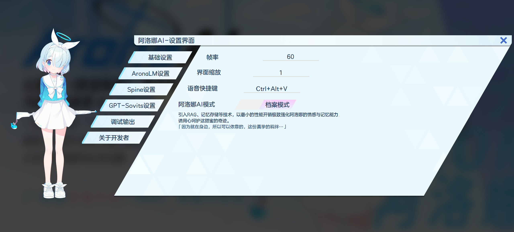

# 阿洛娜AI / AronaAI

<p align="center">
  
</p>

<p align="center">
  <em>基于《蔚蓝档案》角色"阿洛娜"的人工智能助手</em>
</p>

<p align="center">
  <em>An AI assistant based on "Arona" from "Blue Archive"</em>
</p>

<p align="center">
  <em>项目地址：https://github.com/xiahy456/AronaAI</em>
</p>

---

## 📖 项目简介 / Introduction

**阿洛娜AI** 是一个以游戏《蔚蓝档案》（Blue Archive）中角色"阿洛娜"为原型打造的桌面AI助手项目。在设定上，她是“什亭之匣”的操作系统管理员，性格开朗、热情，乐于帮助老师（用户）解决问题。

本项目集成了Arona语言模型（AronaLM）、语音合成（TTS）、语音识别（ASR）、Spine 2D 角色动画等技术，旨在提供一个可爱、有趣且功能完整的桌面交互体验。对话不再是每轮必答：后端先根据关系气候决定开口或沉默，并在老师上线时主动问候。

**AronaAI** is a desktop AI assistant project based on the character "Arona" from the game "Blue Archive". She serves as the operating system administrator of the Shittim Chest, and has a cheerful, warm personality who loves helping Sensei (user) solve problems.

This project integrates Arona Language Model (AronaLM), Text-to-Speech (TTS), Automatic Speech Recognition (ASR), Spine 2D character animation, and other technologies to provide a cute, lively, and fully-featured desktop interaction experience. Replies are no longer mandatory every turn: the backend first decides from relationship climate whether to speak or stay silent, and greets Sensei when they come online.

<p align="center">
  
</p>

<p align="center">
  <em>前端运行截图 - 阿洛娜 & 设置界面</em>
</p>

<p align="center">
  <em>Frontend running screenshot - Arona & Setting Widget</em>
</p>

---

## 🏗️ 项目架构 / Project Architecture

```
arona-ai/
├── backend/                    # Python 后端服务（FastAPI + WebSocket）
│   ├── app/                    # 应用核心
│   │   ├── main.py             # 服务入口
│   │   ├── orchestrator.py     # 对话编排（关系决策 → 检索 → Planner/本地 → 生成 → 记忆抽取）
│   │   ├── model_loader.py     # GGUF 模型加载（llama-cpp-python）
│   │   ├── planner/            # 双模型 Planner（DeepSeek 意图卡 → Renderer）
│   │   ├── proactive/          # 主动事件（上线欢迎、时段）
│   │   ├── relationship/       # 关系气候（信任/依赖/张力、决策）
│   │   ├── knowledge.py        # 世界观知识 RAG
│   │   ├── conversation.py     # 多轮对话历史
│   │   ├── cache.py            # 响应缓存
│   │   ├── prompt.py           # Prompt / Renderer 消息组装
│   │   ├── input_filter.py     # ASR 脏文本过滤（入口兜底）
│   │   ├── embeddings.py       # 本地 BGE 嵌入（记忆 / 知识共用）
│   │   ├── protocol.py         # WebSocket 协议消息
│   │   ├── ws_handler.py       # WebSocket 处理
│   │   ├── config.py           # 配置加载
│   │   ├── logging_utils.py    # 日志工具
│   │   └── memory/             # 长期记忆（SQLite + FTS5 + Chroma + DeepSeek 抽取）
│   ├── scripts/                # 联调 / 灌库 / 测试脚本
│   ├── data/                   # 记忆库、知识语料与向量库
│   │   ├── memory/             # memory.db + chroma + relationship.json
│   │   └── knowledge/          # 语料 corpus + chroma
│   ├── logs/                   # 后端运行日志
│   ├── config.example.yaml     # 配置模板
│   └── requirements.txt
│
├── frontend/                   # 桌面客户端
│   └── AronaAI_Spine_WindowsClient/  # Windows 桌面客户端（Qt/C++）
│       ├── QtMainFile/         # 主界面、控制器、WebSocket 通信
│       ├── QtUtils/            # 工具类（录音、语音识别、动画等）
│       ├── QHotkey/            # 全局快捷键支持
│       ├── spine-cpp/          # Spine 2D 动画运行时
│       ├── Assets/             # 资源文件（Spine 动画、UI 图片、字体）
│       ├── Config/             # 配置文件（配置文件中资源路径为相对路径）
│       ├── dist/               # 编译后的可执行目录
│       │   └── AronaAI_Client/  # 客户端可执行目录（不处理秘钥）
│       │   └── AronaAI_Client_Release/  # 发布版本可执行目录（处理秘钥）
│       └── Dict/               # 词典文件
│
├── llm/                        # 语言模型（其实不是大语言模型啦……只是一开始建项目的时候写错了）
│   └── aronaLM/
│       └── finetune/           # Qwen3-1.7B QLoRA 微调（Unsloth）
│           ├── config/         # 训练 / 导出 / 推理配置
│           ├── training/       # 微调主脚本
│           ├── inference/      # 交互式推理测试
│           ├── export/         # GGUF 导出
│           ├── data-process/   # 数据预处理
│           └── start.bat       # Windows 一键训练
│
├── gpt-sovits/                 # GPT-SoVITS 语音合成（需用户手动部署，或使用外部服务）
│   ├── GPT_SoVITS/             # 核心模型
│   ├── GPT_weights_v2/         # GPT权重
│   │   └── ALuoNa_cn-e15.ckpt  # 阿洛娜GPT权重
│   ├── SoVITS_weights_v2/      # SoVITS权重
│   │   └── ALuoNa_cn_e16_s256.pth    # 阿洛娜SoVITS权重
│   ├── api_v2.py               # API 服务
│   ├── watch-apiv2.ps1         # Windows：API 卡死/崩溃自动重启
│   ├── watch-apiv2.sh          # Linux：API 卡死/崩溃自动重启
│   ├── go-apiv2.bat            # Windows 一键启动 API（经 watchdog）
│   ├── go-apiv2.sh             # Linux 一键启动 API（经 watchdog）
│   └── ref_audio/              # 参考音频
│       └── Arona/              # 阿洛娜参考音频目录
│            └── arona_academy_in_2.ogg   # 推荐的参考音频
│
├── docs/                       # 相关文档
├── models/                     # 相关模型存放目录
│   ├── AronaLM-Renderer-V2.1/  # Renderer GGUF（默认双模型链路）
│   ├── AronaLM-Generator-V2.0/    # AronaLM GGUF（回落 / 本地单模型）
│   ├── bge-small-zh-v1.5/      # 知识 / 记忆嵌入模型
│   └── Qwen3-1.7B-unsloth-bnb-4bit/  # 微调基座（仅训练时需要）
└── assets/                     # 项目资源
```

---

## ✨ 核心功能 / Core Features

### 🤖 AI 对话引擎
- **双模型链路**：**Planner（DeepSeek）→ 结构化意图卡 → Renderer（AronaLM-Renderer-V2.2）**；简单轮次可由路由走本地单模型，Planner 关闭或失败时回落本地路径
- **关系气候**：信任 / 依赖 / 张力三标量构建张量；规则分类用户行动后查表更新，气候分区决定开口、姿态或沉默（数字不进台词）
- **上线欢迎**：WebSocket 连接后按时段主动问候；同槽首次说「早上好」等，再次上线改为「欢迎回来」；深夜/凌晨提醒休息
- **AronaLM-Renderer-V2.2（GGUF）**：`llama-cpp-python` 加载 Qwen3-1.7B 微调 GGUF（默认 Q4_K_M），过滤 `<think>` 推理块；默认双模型路径非流式，本地回落路径可流式
- **记忆与知识分离**：用户长期事实进 SQLite + FTS5 + Chroma（jieba / BGE）；世界观设定进 Markdown 语料 → 本地 BGE + Chroma RAG，互不混写、按需注入 Prompt
- **异步记忆抽取**：对话主路径不阻塞；DeepSeek JSON 抽取（含日配额与缓冲批量），失败或无 Key 时自动正则降级
- **ASR 脏文本过滤**：入口丢弃空串 / 腾讯云 ASR 错误模板，避免误触发 Planner
- **上下文可控**：多轮历史截断 + memory/knowledge/history token budget + 精确匹配响应缓存，控制延迟与重复推理
- **完整微调链路**：Unsloth QLoRA（面向约 6–8GB 显存）→ LoRA 适配器 → 合并导出 GGUF，可直接给后端加载

### 🎤 语音交互
- **语音合成（TTS）**：基于 GPT-SoVITS 的高质量语音合成，还原阿洛娜的声音
- **语音识别（ASR）**：基于腾讯云语音识别（SentenceRecognition）提供在线 ASR

### 🖥️ 桌面客户端
- **Spine 2D 动画**：使用 Spine 实现阿洛娜的 Live2D 角色动画
- **Qt 界面**：基于 Qt/C++ 的 Windows 桌面应用，经 WebSocket 对接后端，可接 GPT-SoVITS TTS 与腾讯云 ASR
- **WebSocket 通信**：与后端服务实时通信，支持流式输出
- **全局快捷键**：支持自定义快捷键操作
- **系统托盘**：最小化到系统托盘运行

---

## 🚀 快速开始 / Quick Start

### 环境要求 / Prerequisites

| 组件 | 要求 |
|------|------|
| Python | 3.10+ |
| CUDA | 11.8（可选，llama.cpp GPU 层 / 微调训练） |
| 操作系统 | Windows 10/11 (客户端) / Linux 及其衍生系统 (服务端) |
| 后端依赖 | `backend/requirements.txt` |
| 微调依赖 | `llm/aronaLM/finetune/requirements.txt`（仅训练时需要） |

### 一键启动所有服务 / Start All Services

```bash
.\start-all.ps1
```

| 参数 | 说明 |
|------|------|
| -CondaEnv | 后端使用的 Conda 环境名称，默认为 `shittim-chest`|
| -TimeoutSec | 每个服务的等待超时时间，默认为 `600` 秒 |
| -FrontendExe | 可选的桌面客户端可执行文件路径，如果未提供，则自动检测 |
| -TtsStallSec | GPT-SoVITS 卡死判定秒数（传给 watchdog），默认 `60` |
| -TtsRestartCooldownSec | GPT-SoVITS 自动重启冷却秒数，默认 `90` |

> **注意**：如果您还没有配置好所有服务，请遵循下文的指示进行配置。  

启动完成后，控制台窗口会保持运行，可单独停止 / 启动 / 重启某一服务：

```text
status                         查看状态
stop backend|gpt|frontend      停止单个服务
start backend|gpt|frontend     启动已停止的服务
restart backend|gpt|frontend   重启单个服务
stop all  /  0  /  q  /  exit  全部停止并退出
```

数字快捷键：`1/2/3` 重启后端 / GPT-SoVITS / 前端，`4/5/6` 停止对应服务。`Ctrl+C` 同样会停止全部已跟踪进程。

> `start-all.ps1` 会通过 `gpt-sovits/watch-apiv2.ps1` 启动 TTS（含卡死自动重启）。若 GPT-SoVITS 部署在**另一台机器**，请在该机器上单独运行 `go-apiv2.bat` / `go-apiv2.sh`，不必使用 `start-all`。

### 后端启动 / Backend Setup

#### 启动前准备 / Pre-startup Preparation

**1. 放置后端模型文件**

```
models/
├── AronaLM-Renderer-V2.1/        # Renderer GGUF（双模型链路）
│   └── AronaLM-Renderer-V2.1.Q4_K_M.gguf
├── AronaLM-Generator-V2.0/          # 可选：本地单模型 / Planner 回落
│   └── AronaLM-Generator-V2.0.Q4_K_M.gguf
└── bge-small-zh-v1.5/            # 知识 / 记忆嵌入模型（启用 knowledge 或记忆向量检索时需要）
```

> **AronaLM-Renderer-V2.1**：请使用 [xiahy456/AronaLM-Renderer-V2.1](https://www.modelscope.cn/models/xiahy456/AronaLM-Renderer-V2.1)。

> **AronaLM-Generator-V2.0**：可选，见 [xiahy456/AronaLM-Generator-V2.0](https://www.modelscope.cn/models/xiahy456/AronaLM-Generator-V2.1)。仅在关闭 Planner 或需要回落单模型时使用。

**2. 配置 `config.yaml`**

```bash
# 在 backend/ 目录下
copy config.example.yaml config.yaml   # Windows
cp config.example.yaml config.yaml   # Linux / macOS
```

按需填写：
- `model.gguf_path`：默认 `AronaLM-Renderer-V2.1`；仅使用单模型时改为注释中的 v2.0 路径
- `planner.enabled` / `planner.api_key`：默认开启双模型；填写 DeepSeek API Key。不填 Key 或关闭 `enabled` 则回落本地单模型
- `memory.extractor.api_key`：DeepSeek API Key（可选；不填则记忆抽取走正则降级）
- `knowledge.enabled`：是否启用世界观 RAG（默认 `false`，启用前请先灌库）
- `proactive.welcome.enabled` / `proactive.relationship.enabled`：上线欢迎与关系气候（默认开启；关系状态落 `data/memory/relationship.json`）

> **注意**：`config.yaml` 已在 `.gitignore` 中，不会被提交到版本控制。

**3. 启动服务**

工作目录必须是 `backend/`：

```bash
conda activate shittim-chest   # 环境配置见 backend README
cd backend
pip install -r requirements.txt

python -m app.main
# 或
uvicorn app.main:app --host 127.0.0.1 --port 20456
```

默认 WebSocket：`ws://127.0.0.1:20456/ws`（与 Qt 客户端一致）。

健康检查：`GET http://127.0.0.1:20456/health`

**4. （可选）联调与知识库**

```bash
# WebSocket 冒烟测试（服务需已启动）
python scripts/smoke_ws.py

# 关系气候 / 上线欢迎单测（不加载 GGUF）
python scripts/test_relationship_unit.py
python scripts/test_welcome_unit.py

# 按 data/knowledge/WRITING.md 编写语料后灌库
python scripts/ingest_knowledge.py

# 大幅改标题/结构后建议：
python scripts/ingest_knowledge.py --rebuild

# 检索冒烟
python scripts/test_knowledge_rag.py
```

启用知识库：在 `config.yaml` 中设 `knowledge.enabled: true` 后重启后端。

### 客户端构建 / Client Build

Windows 客户端使用 Visual Studio 2026 和 Qt 构建：

1. 安装 [Qt 6.x](https://www.qt.io/download)（推荐6.5.3） 和 [Visual Studio 2026](https://visualstudio.microsoft.com/)，并在VS2026中安装`Qt VS Tools`扩展
2. 确保你拥有v143 (Visual Studio 2022)平台工具集，在该项目中需要使用此平台工具集
3. 确保你拥有Qt6.5.3的msvc2019_64，该项目中需要使用此Qt版本（Qt Version可在`Qt VS Tools`的设置中配置）
4. 打开 `frontend/AronaAI_Spine_WindowsClient/AronaAI_Spine_WindowsClient.sln`
5. 配置 Qt 版本和编译选项
6. 编译运行

#### 启动前准备 / Pre-startup Preparation

在启动客户端之前，请完成以下准备工作：

**配置 `config.json`**

找到 `frontend/AronaAI_Spine_WindowsClient/Config/config.example.json`，复制并重命名配置文件，然后至少填写以下关键项：

```bash
# 复制并重命名配置文件
cp frontend/AronaAI_Spine_WindowsClient/Config/config.example.json frontend/AronaAI_Spine_WindowsClient/Config/config.json
```

```json
{
  "aronalm": {
    "websocket_url": "ws://your.aronalm.ip:20456/ws" // AronaLM 后端 WebSocket 地址
  },
  "tts": {
    "host": "your.gpt.sovits.ip", // GPT-SoVITS 服务地址
  },
  "tencent_speech_recognizer": {
    "secret_id": "${TENCENT_SECRET_ID}", // 腾讯云语音识别 SecretId（可用环境变量占位）
    "secret_key": "${TENCENT_SECRET_KEY}" // 腾讯云语音识别 SecretKey（可用环境变量占位）
  }
}
```

完整字段说明见 [`frontend/AronaAI_Spine_WindowsClient/README.md`](frontend/AronaAI_Spine_WindowsClient/README.md)。

> **注意**：
 - 资源路径相对**程序工作目录**解析；在 Visual Studio 中调试时默认为项目根目录，请勿直接双击 `x64/Debug` 或 `x64/Release` 下的 exe（工作目录会不对）。
 - 请将 AronaLM 后端服务、GPT-SoVITS 服务的地址、端口按实际情况填写。
 - `tts.request_timeout_ms` 仅改配置即可生效（dist 客户端同理）；`TTSManager` / `MainController` 源码改动需重新编译客户端后才有超时与字幕兜底逻辑。
 - 使用 `pack_keep_secrects.ps1` 打包便携版时，脚本会自动写入与包内布局一致的相对路径，并保留配置文件中的腾讯云 SecretId 和 SecretKey。
 - 使用`pack_sanitize_secrets.ps1` 打包便携版时，脚本会自动写入与包内布局一致的相对路径，并删除配置文件中的腾讯云 SecretId 和 SecretKey。
 - 本项目使用**腾讯云语音识别**（ASR），腾讯云 ASR 的 SecretId 和 SecretKey 可以在腾讯云控制台的 API 密钥管理中获取。

> **注意**：`config.json` 已在 `.gitignore` 中，不会被提交到版本控制，请放心修改。

### 语音合成服务 / TTS Service

#### 放置 GPT-SoVITS 模型文件 / Place GPT-SoVITS Model Files

```
models/
├── GPT_weights_v2/            # GPT 模型权重
│   └── ALuoNa_cn-e15.ckpt
└── SoVITS_weights_v2/         # SoVITS 模型权重
│   └── ALuoNa_cn_e16_s256.pth
```

#### 放置参考音频文件 / Place Reference Audio Files

```
gpt-sovits/ref_audio/Arona/arona_academy_in_2.ogg
```

#### 启动 GPT-SoVITS API 服务 / Start GPT-SoVITS API Service

```bash
# 在 GPT-SoVITS 所在机器上启动（推荐：带卡死自动重启的 watchdog）
cd gpt-sovits
# Windows: go-apiv2.bat
# Linux:   chmod +x go-apiv2.sh && ./go-apiv2.sh
```

`go-apiv2` 会调用 `watch-apiv2`：当推理日志长时间停在「提取文本Bert特征」或「预测语义Token」时，自动结束进程并重启 API。

可选参数（PowerShell）：

```powershell
.\watch-apiv2.ps1 -StallSec 60 -RestartCooldownSec 90 -LogPath D:\logs\gpt-sovits.log
```

Linux：

```bash
./watch-apiv2.sh --stall-sec 60 --restart-cooldown 90 --log-path /var/log/gpt-sovits.log
```

**异机部署**：TTS 与客户端不在同一台机器时——在 TTS 机运行上述 `go-apiv2`；在客户端 `config.json` 将 `tts.host` 设为 TTS 机 IP，并配置 `request_timeout_ms`（建议 `45000`）。客户端超时只负责不堵 UI；**自动重启必须在 TTS 机上的 watchdog 完成**。

> 仅调试、不要自动重启时，仍可直接运行 `python api_v2.py`（或 `runtime\python.exe -X utf8 -I api_v2.py`）。

### 模型微调 / Finetune（可选）

若需自行微调阿洛娜风格模型，使用 `llm/aronaLM/finetune`（基于 Unsloth 对 Qwen3-1.7B 做 QLoRA，面向约 6–8GB 显存）：

```bat
cd llm\aronaLM\finetune
python -m venv .venv
.venv\Scripts\activate
pip install torch torchvision torchaudio --index-url https://download.pytorch.org/whl/cu124
pip install -r requirements.txt

REM 放置基座模型到 models/Qwen3-1.7B-unsloth-bnb-4bit 后：
start.bat
```

训练结束后可导出 GGUF，供后端 `model.gguf_path` 加载。详细说明见 [`llm/aronaLM/finetune/README.md`](llm/aronaLM/finetune/README.md)。

---

## 📚 模块与配置 / Modules & Configuration

各模块说明、协议与配置见对应 README：

| 模块 | 文档 |
|------|------|
| **Backend**（含 `config.yaml`） | [`backend/README.md`](backend/README.md) |
| **桌面客户端**（含 `config.json`） | [`frontend/AronaAI_Spine_WindowsClient/README.md`](frontend/AronaAI_Spine_WindowsClient/README.md) |
| **LLM 微调**（`llm/aronaLM/finetune`） | [`llm/aronaLM/finetune/README.md`](llm/aronaLM/finetune/README.md) |

---

## 📄 许可证 / License

本项目基于 Apache License 2.0 开源协议。

```
Copyright 2026 xia_hy456. All rights reserved.

Licensed under the Apache License, Version 2.0 (the "License");
you may not use this file except in compliance with the License.
You may obtain a copy of the License at

    http://www.apache.org/licenses/LICENSE-2.0

Unless required by applicable law or agreed to in writing, software
distributed under the License is distributed on an "AS IS" BASIS,
WITHOUT WARRANTIES OR CONDITIONS OF ANY KIND, either express or implied.
See the License for the specific language governing permissions and
limitations under the License.
```

---

## 🙏 致谢 / Acknowledgements

- **《蔚蓝档案》(Blue Archive)** - 一切奇迹的起点（https://bluearchive-cn.com/）
- **Spine** - 2D 动画引擎（https://esotericsoftware.com/）
- **基沃托斯古书馆** - Spine 动画资源（https://kivo.wiki/）
- **Qt** - 跨平台 GUI 框架（https://www.qt.io/）
- **llama.cpp / llama-cpp-python** - 本地 GGUF 推理（https://github.com/ggml-org/llama.cpp）
- **Qwen3-1.7B** - 微调训练基底模型（https://huggingface.co/Qwen/Qwen3-1.7B）
- **Unsloth** - QLoRA 高效微调（https://unsloth.ai/）
- **ChromaDB** - 向量数据库（https://www.trychroma.com/products/chromadb）
- **DeepSeek** - Planner 意图规划与记忆抽取 API（https://www.deepseek.com/）
- **GPT-SoVITS** - 语音合成模型（https://github.com/RVC-Boss/GPT-SoVITS）
- **腾讯云语音识别** - 在线语音识别（https://cloud.tencent.com/product/asr）
- **bge-small-zh-v1.5** - 文本嵌入模型（https://huggingface.co/BAAI/bge-small-zh-v1.5）
- **感谢所有协助开发的贡献者们**

---

## ⭐ 关于开发者 / About Developer

- **项目发起者**: xia_hy456
- **发起者个人博客**: https://xia-hy456.top/
- **反馈问题**: 2066961858@qq.com

---

<p align="center">
  <sub>/* 就像草莓牛奶一样的，甜蜜的奇迹 */</sub>
</p>
