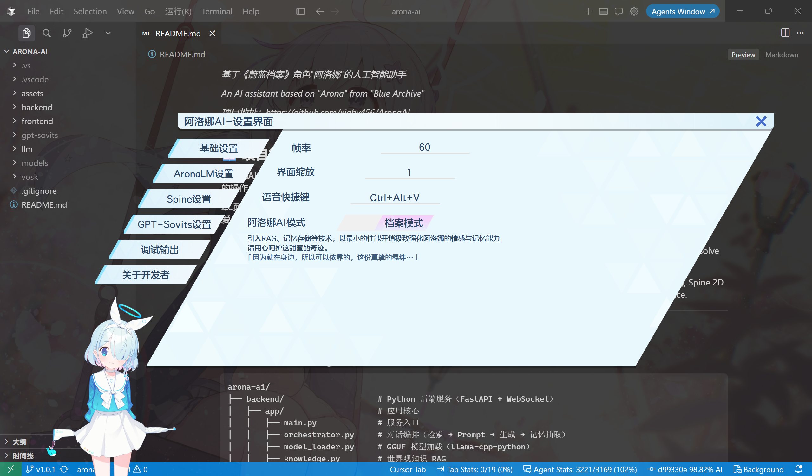

# 阿洛娜AI / AronaAI

<p align="center">
  
</p>

<p align="center">
  <em>基于《蔚蓝档案》角色"阿洛娜"的人工智能助手</em>
</p>

<p align="center">
  <em>An AI assistant based on "Arona" from "Blue Archive"</em>
</p>

<p align="center">
  <em>项目地址：https://github.com/xiahy456/AronaAI</em>
</p>

---

## 📖 项目简介 / Introduction

**阿洛娜AI** 是一个以游戏《蔚蓝档案》（Blue Archive）中角色"阿洛娜"为原型打造的桌面AI助手项目。在设定上，她是“什亭之匣”的操作系统管理员，性格开朗、热情，乐于帮助老师（用户）解决问题。

本项目集成了Arona语言模型（AronaLM）、语音合成（TTS）、语音识别（ASR）、Spine 2D 角色动画等技术，旨在提供一个可爱、有趣且功能完整的桌面交互体验。

**AronaAI** is a desktop AI assistant project based on the character "Arona" from the game "Blue Archive". She serves as the operating system administrator of the Shittim Chest, and has a cheerful, warm personality who loves helping Sensei (user) solve problems.

This project integrates Arona Language Model (AronaLM), Text-to-Speech (TTS), Automatic Speech Recognition (ASR), Spine 2D character animation, and other technologies to provide a cute, lively, and fully-featured desktop interaction experience.

<p align="center">
  
</p>

<p align="center">
  <em>前端运行时截图</em>
</p>

<p align="center">
  <em>Frontend running screenshot</em>
</p>

---

## 🏗️ 项目架构 / Project Architecture

```
arona-ai/
├── backend/                    # Python 后端服务（FastAPI + WebSocket）
│   ├── app/                    # 应用核心
│   │   ├── main.py             # 服务入口
│   │   ├── orchestrator.py     # 对话编排（检索 → Prompt → 生成 → 记忆抽取）
│   │   ├── model_loader.py     # GGUF 模型加载（llama-cpp-python）
│   │   ├── knowledge.py        # 世界观知识 RAG
│   │   ├── conversation.py     # 多轮对话历史
│   │   ├── cache.py            # 响应缓存
│   │   ├── prompt.py           # Prompt 组装
│   │   ├── protocol.py         # WebSocket 协议消息
│   │   ├── ws_handler.py       # WebSocket 处理
│   │   ├── config.py           # 配置加载
│   │   └── memory/             # 长期记忆（SQLite + DeepSeek 抽取）
│   ├── scripts/                # 联调 / 灌库 / 测试脚本
│   ├── data/                   # 记忆库、知识语料与向量库
│   ├── config.example.yaml     # 配置模板
│   └── requirements.txt
│
├── frontend/                   # 桌面客户端
│   └── AronaAI_Spine_WindowsClient/  # Windows 桌面客户端（Qt/C++）
│       ├── QtMainFile/         # 主界面、控制器、WebSocket 通信
│       ├── QtUtils/            # 工具类（录音、语音识别、动画等）
│       ├── QHotkey/            # 全局快捷键支持
│       ├── spine-cpp/          # Spine 2D 动画运行时
│       ├── Assets/             # 资源文件（Spine 动画、UI 图片、字体）
│       ├── Config/             # 配置文件（配置文件中资源路径为相对路径）
│       ├── dist/               # 编译后的可执行目录
│       │   └── AronaAI_Client/  # 客户端可执行目录（不处理秘钥）
│       │   └── AronaAI_Client_Release/  # 发布版本可执行目录（处理秘钥）
│       └── Dict/               # 词典文件
│
├── llm/                        # 语言模型（其实不是大语言模型啦……只是一开始建项目的时候写错了）
│   └── aronaLM/
│       └── finetune/           # Qwen3-1.7B QLoRA 微调（Unsloth）
│           ├── config/         # 训练 / 导出 / 推理配置
│           ├── training/       # 微调主脚本
│           ├── inference/      # 交互式推理测试
│           ├── export/         # GGUF 导出
│           ├── data-process/   # 数据预处理
│           └── start.bat       # Windows 一键训练
│
├── gpt-sovits/                 # GPT-SoVITS 语音合成（需用户手动部署，或使用外部服务）
│   ├── GPT_SoVITS/             # 核心模型
│   ├── GPT_weights_v2/         # GPT权重
│   │   └── ALuoNa_cn-e15.ckpt  # 阿洛娜GPT权重
│   ├── SoVITS_weights_v2/      # SoVITS权重
│   │   └── ALuoNa_cn_e16_s256.pth    # 阿洛娜SoVITS权重
│   ├── api_v2.py               # API 服务
│   ├── watch-apiv2.ps1         # Windows：API 卡死/崩溃自动重启
│   ├── watch-apiv2.sh          # Linux：API 卡死/崩溃自动重启
│   ├── go-apiv2.bat            # Windows 一键启动 API（经 watchdog）
│   ├── go-apiv2.sh             # Linux 一键启动 API（经 watchdog）
│   └── ref_audio/              # 参考音频
│       └── Arona/              # 阿洛娜参考音频目录
│            └── arona_academy_in_2.ogg   # 推荐的参考音频
│
├── docs/                       # 相关文档
├── models/                     # 相关模型存放目录
│   ├── aronalm-v2.0-normal/    # AronaLM GGUF 语言模型
│   ├── bge-small-zh-v1.5/      # 知识 RAG 嵌入模型
│   └── Qwen3-1.7B-unsloth-bnb-4bit/  # 微调基座（仅训练时需要）
└── assets/                     # 项目资源
```

---

## ✨ 核心功能 / Core Features

### 🤖 AI 对话引擎
- **AronaLM（GGUF）**：通过 `llama-cpp-python` 加载微调后的 GGUF 模型，支持同步与流式生成
- **世界观知识 RAG**：Markdown 语料入库 ChromaDB，按需检索并注入 Prompt
- **长期记忆**：SQLite 持久化用户信息；DeepSeek 异步抽取（可降级为正则）
- **响应缓存**：相同问题快速命中，降低重复推理开销
- **对话管理**：多轮历史截断，配合 token budget 控制上下文长度

### 🎤 语音交互
- **语音合成（TTS）**：基于 GPT-SoVITS 的高质量语音合成，还原阿洛娜的声音
- **语音识别（ASR）**：基于腾讯云语音识别（SentenceRecognition）提供在线 ASR
- **语音唤醒**：支持语音输入触发对话

### 🖥️ 桌面客户端
- **Spine 2D 动画**：使用 Spine 实现阿洛娜的 Live2D 角色动画
- **Qt 界面**：基于 Qt/C++ 的 Windows 桌面应用
- **WebSocket 通信**：与后端服务实时通信，支持流式输出
- **全局快捷键**：支持自定义快捷键操作
- **系统托盘**：最小化到系统托盘运行

### 🎯 技术亮点
- **本地推理主路径**：后端以 `llama-cpp-python` 加载 Qwen3-1.7B 微调后的 GGUF（Q4_K_M），支持同步/流式生成，并过滤 `<think>` 推理块
- **记忆与知识分离**：用户长期事实进 SQLite + FTS5（jieba 检索）；世界观设定进 Markdown 语料 → 本地 BGE + Chroma RAG，互不混写
- **异步记忆抽取**：对话主路径不阻塞；DeepSeek JSON 抽取（含日配额），失败或无 Key 时自动正则降级
- **完整微调链路**：Unsloth QLoRA（面向约 6–8GB 显存）→ LoRA 适配器 → 合并导出 GGUF，可直接给后端加载
- **桌面端完整交互**：Qt/C++ + Spine 桌宠客户端经 WebSocket 对接后端；可接 GPT-SoVITS TTS 与腾讯云 ASR
- **上下文可控**：多轮历史截断 + memory/knowledge/history token budget + 精确匹配响应缓存，控制延迟与重复推理

---

## 🚀 快速开始 / Quick Start

### 环境要求 / Prerequisites

| 组件 | 要求 |
|------|------|
| Python | 3.10+ |
| CUDA | 11.8（可选，llama.cpp GPU 层 / 微调训练） |
| 操作系统 | Windows 10/11 (客户端) / Linux 及其衍生系统 (服务端) |
| 后端依赖 | `backend/requirements.txt` |
| 微调依赖 | `llm/aronaLM/finetune/requirements.txt`（仅训练时需要） |

### 一键启动所有服务 / Start All Services

```bash
.\start-all.ps1
```

| 参数 | 说明 |
|------|------|
| -CondaEnv | 后端使用的 Conda 环境名称，默认为 `shittim-chest` |
| -TimeoutSec | 每个服务的等待超时时间，默认为 `600` 秒 |
| -FrontendExe | 可选的桌面客户端可执行文件路径，如果未提供，则自动检测 |
| -TtsStallSec | GPT-SoVITS 卡死判定秒数（传给 watchdog），默认 `60` |
| -TtsRestartCooldownSec | GPT-SoVITS 自动重启冷却秒数，默认 `90` |

> **注意**：如果您还没有配置好所有服务，请遵循下文的指示进行配置。  
> `start-all.ps1` 会通过 `gpt-sovits/watch-apiv2.ps1` 启动 TTS（含卡死自动重启）。若 GPT-SoVITS 部署在**另一台机器**，请在该机器上单独运行 `go-apiv2.bat` / `go-apiv2.sh`，不必使用 `start-all`。

### 后端启动 / Backend Setup

#### 启动前准备 / Pre-startup Preparation

**1. 放置后端模型文件**

```
models/
├── aronalm-v2.0-normal/          # AronaLM GGUF（后端推理）
│   └── aronalm-v2.0-normal.Q4_K_M.gguf
└── bge-small-zh-v1.5/            # 知识 RAG 嵌入模型（启用 knowledge 时需要）
```

> **AronaLM**：请使用模型 [xiahy456/aronalm-v2.0-normal](https://www.modelscope.cn/models/xiahy456/aronalm-v2.0-normal)

**2. 配置 `config.yaml`**

```bash
# 在 backend/ 目录下
copy config.example.yaml config.yaml   # Windows
cp config.example.yaml config.yaml   # Linux / macOS
```

按需填写：
- `model.gguf_path`：GGUF 模型路径
- `memory.extractor.api_key`：DeepSeek API Key（可选；不填则记忆抽取走正则降级）
- `knowledge.enabled`：是否启用世界观 RAG（默认 `false`，启用前请先灌库）

> **注意**：`config.yaml` 已在 `.gitignore` 中，不会被提交到版本控制。

**3. 启动服务**

工作目录必须是 `backend/`：

```bash
conda activate shittim-chest   # 若使用已有 conda 环境
cd backend
pip install -r requirements.txt

python -m app.main
# 或
uvicorn app.main:app --host 127.0.0.1 --port 20456
```

默认 WebSocket：`ws://127.0.0.1:20456/ws`（与 Qt 客户端一致）。

健康检查：`GET http://127.0.0.1:20456/health`

**4. （可选）联调与知识库**

```bash
# WebSocket 冒烟测试（服务需已启动）
python scripts/smoke_ws.py

# 按 data/knowledge/WRITING.md 编写语料后灌库
python scripts/ingest_knowledge.py
# 大幅改标题/结构后建议：
python scripts/ingest_knowledge.py --rebuild

# 检索冒烟
python scripts/test_knowledge_rag.py
```

启用知识库：在 `config.yaml` 中设 `knowledge.enabled: true` 后重启后端。

### 客户端构建 / Client Build

Windows 客户端使用 Visual Studio 2026 和 Qt 构建：

1. 安装 [Qt 6.x](https://www.qt.io/download)（推荐6.5.3） 和 [Visual Studio 2026](https://visualstudio.microsoft.com/)，并在VS2026中安装`Qt VS Tools`扩展
2. 确保你拥有v143 (Visual Studio 2022)平台工具集，在该项目中需要使用此平台工具集
3. 确保你拥有Qt6.5.3的msvc2019_64，该项目中需要使用此Qt版本（Qt Version可在`Qt VS Tools`的设置中配置）
4. 打开 `frontend/AronaAI_Spine_WindowsClient/AronaAI_Spine_WindowsClient.sln`
5. 配置 Qt 版本和编译选项
6. 编译运行

#### 启动前准备 / Pre-startup Preparation

在启动客户端之前，请完成以下准备工作：

**1. 配置 `config.json`**

找到 `frontend/AronaAI_Spine_WindowsClient/Config/config.example.json`，复制并重命名配置文件，然后按需修改服务地址等配置：

```bash
# 复制并重命名配置文件
cp frontend/AronaAI_Spine_WindowsClient/Config/config.example.json frontend/AronaAI_Spine_WindowsClient/Config/config.json
```

```json
{
  "settings": {
    "frame_rate": 60, // 全局帧率
    "dict_path": "Dict/dict_zh.json", // 词典文件路径
    "zoom": 1.0, // 界面缩放比例
    "transparent": 1.0, // 主窗口整体不透明度（0.0~1.0）
    "offset_from_screen_bottom": -50, // 主窗口相对屏幕底部的向上偏移（像素）
    "offset_from_screen_left": 0, // 主窗口相对屏幕左侧的向右偏移（像素）
    "output_text_box_offset": -50, // 输出文本框相对默认位置的垂直偏移（像素；正值向上，负值向下）
    "mouse_event_transparent": true, // 是否启用鼠标穿透（点击穿透桌宠）
    "open_setting_widget": false, // 启动时是否自动打开设置窗口
    "arona_ai_mode": 0, // 阿洛娜 AI 模式：0=日程模式，1=档案模式
  },
  "aronalm": {
    "websocket_url": "ws://your.aronalm.ip:20456/ws", // AronaLM 后端 WebSocket 地址
    "heartbeat_interval": 30000, // 心跳发送间隔（毫秒）
    "heartbeat_timeout": 10000, // 心跳超时时间（毫秒）
    "reconnect_interval": 3000, // 断线重连间隔（毫秒）
    "max_reconnect_attempts": 5, // 最大重连次数
    "use_cache": true, // 是否启用响应缓存
    "use_rag": true, // 是否启用知识库 RAG 检索
    "use_memory": true // 是否启用长期记忆
  },
  "spine": {
    "skelOrJson_path": "Assets/AronaSpineAssets/arona_spr_full.skel", // Spine 骨架文件（.skel / .json）路径（如果想要普拉娜可以改为Assets/AronaSpineAssets/NP0035_spr.skel）
    "atlas_path": "Assets/AronaSpineAssets/arona_spr_full.atlas", // Spine 图集 atlas 路径（如果想要普拉娜可以改为Assets/AronaSpineAssets/NP0035_spr.atlas）
    "animation_default_mix": 0.2 // 动画默认过渡混合时间（秒）
  },
  "tts": {
    "host": "your.gpt.sovits.ip", // GPT-SoVITS 服务地址
    "port": 9880, // GPT-SoVITS 服务端口
    "gpt_path": "GPT_weights_v2/ALuoNa_cn-e15.ckpt", // 推荐的 GPT 模型权重路径（服务端侧）
    "sovits_path": "SoVITS_weights_v2/ALuoNa_cn_e16_s256.pth", // 推荐的 SoVITS 模型权重路径（服务端侧）
    "ref_audio_path": "ref_audio/Arona/arona_academy_in_2.ogg", // 推荐的参考音频路径（服务端侧）
    "prompt_text": "这里为您准备了各种课程和活动，请按您喜欢的方式安排日程吧！", // 参考音频对应的提示文本
    "prompt_lang": "zh", // 提示文本语言
    "top_k": 15, // Top-K 采样
    "top_p": 1.0, // Top-P 采样
    "temperature": 1.0, // 采样温度
    "text_split_method": "cut0", // 文本分割方法
    "batch_size": 1, // 批处理大小
    "batch_threshold": 0.75, // 批处理阈值
    "split_bucket": true, // 是否按桶分割推理
    "speed_factor": 1.0, // 语速因子
    "fragment_interval": 0.3, // 片段间隔（秒）
    "seed": -1, // 随机种子（-1 表示随机）
    "streaming_mode": false, // 是否启用流式合成
    "parallel_infer": true, // 是否启用并行推理（8GB 显卡建议 false）
    "request_timeout_ms": 45000, // 客户端等待 /tts 的超时（毫秒）；超时后仍显示字幕，不卡死 UI
    "repetition_penalty": 1.35, // 重复惩罚系数
    "sample_steps": 32, // 采样步数
    "super_sampling": false // 是否启用超采样
  },
  "audio_input": {
    "device": "" // 音频输入设备名（空字符串表示使用系统默认设备）
  },
  "short_cut_key": {
    "switch_audio_input": "Ctrl+Alt+V", // 切换 / 触发语音输入的快捷键
    "switch_mouse_transparent": "Ctrl+Alt+C"  // 切换 / 触发鼠标穿透的快捷键
  },
  "tencent_speech_recognizer": {
    "secret_id": "${TENCENT_SECRET_ID}", // 腾讯云 SecretId（可用环境变量占位）
    "secret_key": "${TENCENT_SECRET_KEY}" // 腾讯云 SecretKey（可用环境变量占位）
  }
}
```

> **注意**：
 - 资源路径相对**程序工作目录**解析；在 Visual Studio 中调试时默认为项目根目录，请勿直接双击 `x64/Debug` 或 `x64/Release` 下的 exe（工作目录会不对）。
 - 请将 AronaLM 后端服务、GPT-SoVITS 服务的地址、端口按实际情况填写。
 - `tts.request_timeout_ms` 仅改配置即可生效（dist 客户端同理）；`TTSManager` / `MainController` 源码改动需重新编译客户端后才有超时与字幕兜底逻辑。
 - 使用 `pack_keep_secrects.ps1` 打包便携版时，脚本会自动写入与包内布局一致的相对路径，并保留配置文件中的腾讯云 SecretId 和 SecretKey。
 - 使用`pack_sanitize_secrets.ps1` 打包便携版时，脚本会自动写入与包内布局一致的相对路径，并删除配置文件中的腾讯云 SecretId 和 SecretKey。

**2. 配置腾讯云语音识别**

桌面客户端语音输入依赖腾讯云 ASR，请在 `tencent_speech_recognizer` 中填写自己的 `secret_id` 和 `secret_key`，或者通过环境变量配置：

- **方式一（推荐）**：设置环境变量 `TENCENT_SECRET_ID` 和 `TENCENT_SECRET_KEY`，配置文件中的 `${TENCENT_SECRET_ID}` 和 `${TENCENT_SECRET_KEY}` 会自动读取环境变量。
- **方式二**：直接在配置文件中填写你的腾讯云 API 密钥：
  ```json
  "tencent_speech_recognizer": {
    "secret_id": "your_secret_id_here",
    "secret_key": "your_secret_key_here"
  }
  ```

> **注意**：`config.json` 已在 `.gitignore` 中，不会被提交到版本控制，请放心修改。

### 语音合成服务 / TTS Service

#### 放置 GPT-SoVITS 模型文件 / Place GPT-SoVITS Model Files

```
models/
├── GPT_weights_v2/            # GPT 模型权重
│   └── ALuoNa_cn-e15.ckpt
└── SoVITS_weights_v2/         # SoVITS 模型权重
│   └── ALuoNa_cn_e16_s256.pth
```

#### 放置参考音频文件 / Place Reference Audio Files

```
gpt-sovits/ref_audio/Arona/arona_academy_in_2.ogg
```

#### 启动 GPT-SoVITS API 服务 / Start GPT-SoVITS API Service

```bash
# 在 GPT-SoVITS 所在机器上启动（推荐：带卡死自动重启的 watchdog）
cd gpt-sovits
# Windows: go-apiv2.bat
# Linux:   chmod +x go-apiv2.sh && ./go-apiv2.sh
```

`go-apiv2` 会调用 `watch-apiv2`：当推理日志长时间停在「提取文本Bert特征」或「预测语义Token」时，自动结束进程并重启 API。

可选参数（PowerShell）：

```powershell
.\watch-apiv2.ps1 -StallSec 60 -RestartCooldownSec 90 -LogPath D:\logs\gpt-sovits.log
```

Linux：

```bash
./watch-apiv2.sh --stall-sec 60 --restart-cooldown 90 --log-path /var/log/gpt-sovits.log
```

**异机部署**：TTS 与客户端不在同一台机器时——在 TTS 机运行上述 `go-apiv2`；在客户端 `config.json` 将 `tts.host` 设为 TTS 机 IP，并配置 `request_timeout_ms`（建议 `45000`）。客户端超时只负责不堵 UI；**自动重启必须在 TTS 机上的 watchdog 完成**。

> 仅调试、不要自动重启时，仍可直接运行 `python api_v2.py`（或 `runtime\python.exe -X utf8 -I api_v2.py`）。

### 模型微调 / Finetune（可选）

若需自行微调阿洛娜风格模型，使用 `llm/aronaLM/finetune`（基于 Unsloth 对 Qwen3-1.7B 做 QLoRA，面向约 6–8GB 显存）：

```bat
cd llm\aronaLM\finetune
python -m venv .venv
.venv\Scripts\activate
pip install torch torchvision torchaudio --index-url https://download.pytorch.org/whl/cu124
pip install -r requirements.txt

REM 放置基座模型到 models/Qwen3-1.7B-unsloth-bnb-4bit 后：
start.bat
```

训练结束后可导出 GGUF，供后端 `model.gguf_path` 加载。详细说明见 [`llm/aronaLM/finetune/README.md`](llm/aronaLM/finetune/README.md)。

---

## 🔧 配置说明 / Configuration

### 后端配置 (`backend/config.yaml`)

由 `config.example.yaml` 复制而来，主要段落：

| 配置段 | 说明 |
|--------|------|
| `server` | 监听地址、端口、WebSocket 路径（默认 `/ws`） |
| `model` | GGUF 路径、上下文长度、采样参数、system prompt |
| `conversation` | 多轮历史保留轮数 |
| `knowledge` | 世界观 RAG（语料目录、Chroma、嵌入模型、检索阈值） |
| `memory` | SQLite 路径、检索条数、DeepSeek 抽取器（`every_n_turns` / `extract_buffer_turns` 缓冲批量）与正则降级 |
| `cache` | 响应缓存开关与容量 |
| `token_budget` | memory / knowledge / history 注入预算 |

本地数据路径（均已 gitignore）：
- 记忆库：`backend/data/memory.db`
- 知识向量库：`backend/data/knowledge/chroma/`

### 客户端配置

客户端配置文件位于 `frontend/AronaAI_Spine_WindowsClient/Config/`，可配置：
- 资源文件相对路径（Dict / Assets / 字体等，相对项目工作目录）
- WebSocket 服务器地址和端口
- TTS 服务地址
- 语音识别参数
- 快捷键绑定

---

## 📚 模块详解 / Module Details

### Backend 模块

| 模块 | 路径 | 功能描述 |
|------|------|----------|
| **服务入口** | `app/main.py` | FastAPI 应用、健康检查、WebSocket 路由 |
| **对话编排** | `app/orchestrator.py` | 缓存 → 记忆/知识检索 → Prompt → 生成 → 异步记忆抽取 |
| **模型加载** | `app/model_loader.py` | llama-cpp-python 加载 GGUF，支持流式与 `<think>` 过滤 |
| **WebSocket** | `app/ws_handler.py` | 会话连接、消息分发 |
| **协议** | `app/protocol.py` | 客户端/服务端消息类型定义 |
| **对话历史** | `app/conversation.py` | 多轮历史管理与截断 |
| **知识 RAG** | `app/knowledge.py` | ChromaDB 检索世界观知识 |
| **记忆存储** | `app/memory/store.py` | SQLite 长期记忆读写 |
| **记忆抽取** | `app/memory/extractor.py` | DeepSeek 异步抽取（失败走正则） |
| **响应缓存** | `app/cache.py` | 相同输入快速返回 |
| **Prompt** | `app/prompt.py` | 组装 system / memory / knowledge / history |

**WebSocket 协议摘要**：连接后服务端发送 `{"type":"connected","session_id":"..."}`。客户端发起对话示例：

```json
{"type":"chat","content":"你好","stream":false,"options":{"use_cache":true,"use_rag":true,"use_memory":true}}
```

更多细节见 [`backend/README.md`](backend/README.md)。

### LLM 微调模块（`llm/aronaLM/finetune`）

基于 Unsloth 对本地 `Qwen3-1.7B-unsloth-bnb-4bit` 做 QLoRA 微调，ShareGPT JSONL 数据，训练后可导出 GGUF 供 llama.cpp / 后端使用。

| 模块 | 功能描述 |
|------|----------|
| **配置** | `config/config.yaml` 统一管理模型、LoRA、训练、导出、推理参数 |
| **训练** | `training/train.py` / `start.bat` 一键 QLoRA 微调 |
| **推理** | `inference/inference.py` 加载 LoRA 适配器做交互测试 |
| **导出** | 训练结束导出 LoRA 适配器与 GGUF（默认 `q4_k_m`） |
| **数据** | ShareGPT 格式 JSONL；可用 `data-process/` 合并预处理 |

---

## 📄 许可证 / License

本项目基于 Apache License 2.0 开源协议。

```
Copyright 2026 xia_hy456. All rights reserved.

Licensed under the Apache License, Version 2.0 (the "License");
you may not use this file except in compliance with the License.
You may obtain a copy of the License at

    http://www.apache.org/licenses/LICENSE-2.0

Unless required by applicable law or agreed to in writing, software
distributed under the License is distributed on an "AS IS" BASIS,
WITHOUT WARRANTIES OR CONDITIONS OF ANY KIND, either express or implied.
See the License for the specific language governing permissions and
limitations under the License.
```

---

## 🙏 致谢 / Acknowledgements

- **《蔚蓝档案》(Blue Archive)** - 角色原型
- **Spine** - 2D 动画引擎
- **Qt** - 跨平台 GUI 框架
- **llama.cpp / llama-cpp-python** - 本地 GGUF 推理
- **Qwen3-1.7B** - 微调训练基底模型
- **Unsloth** - QLoRA 高效微调
- **ChromaDB** - 向量数据库
- **DeepSeek** - 记忆抽取 API
- **GPT-SoVITS** - 语音合成模型
- **腾讯云语音识别** - 在线语音识别
- **Sentence-Transformers** - 文本嵌入模型
- **感谢所有协助开发的贡献者们**

---

## ⭐ 关于开发者 / About Developer

- **项目发起者**: xia_hy456
- **发起者个人博客**: https://xia-hy456.top/
- **反馈问题**: 2066961858@qq.com

---

<p align="center">
  <sub>/* 就像草莓牛奶一样的，甜蜜的奇迹 */</sub>
</p>
